# AudioSpace — The Ultimate Virtual Audio Environment Simulator

AudioSpace is a browser-based music player wrapped around a physically-modelled listening room. Import your local library, pick any of **100 best-selling bookshelf speakers** and **100 subwoofers**, drive them with a simulated **AV receiver**, place everything in a **3D room** and hear the result — crossovers, amplifier clipping, corner loading, room modes, reverberation and binaural HRTF — in real time.

Everything runs locally with the Web Audio API. Your music never leaves your device. No build step, no runtime dependencies.

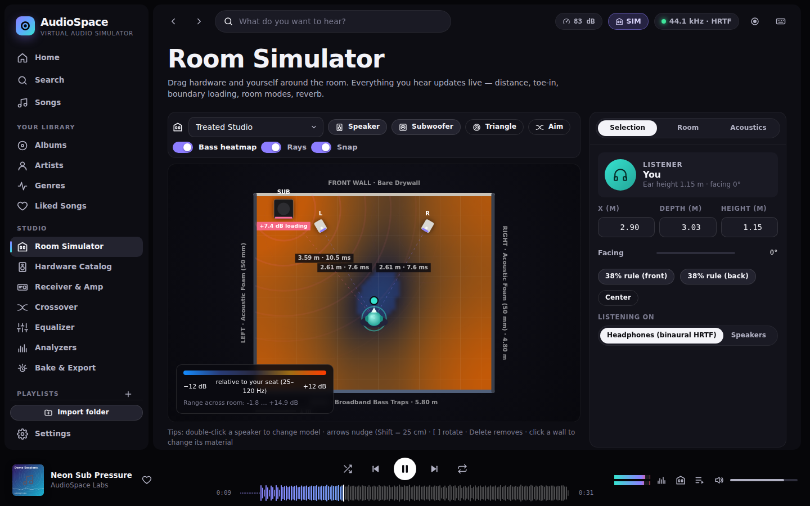

| | |
|---|---|
| 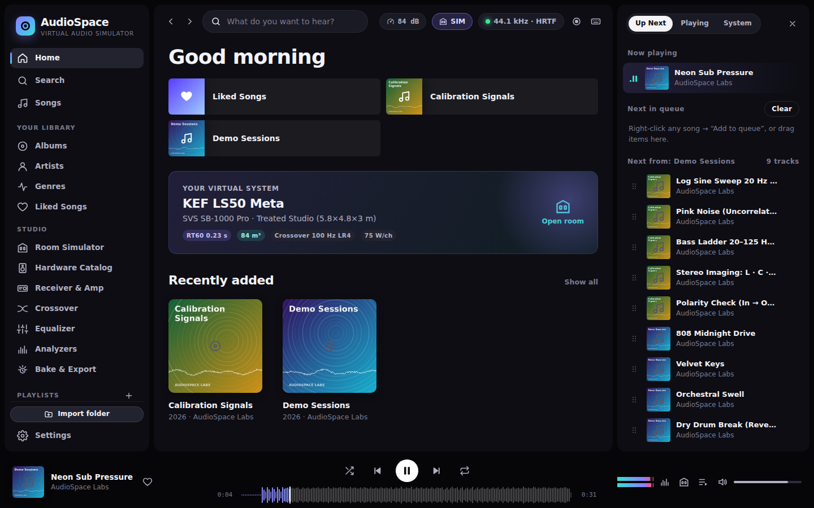 | 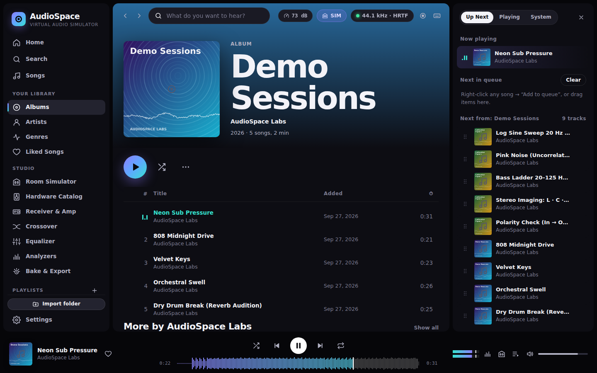 |
| 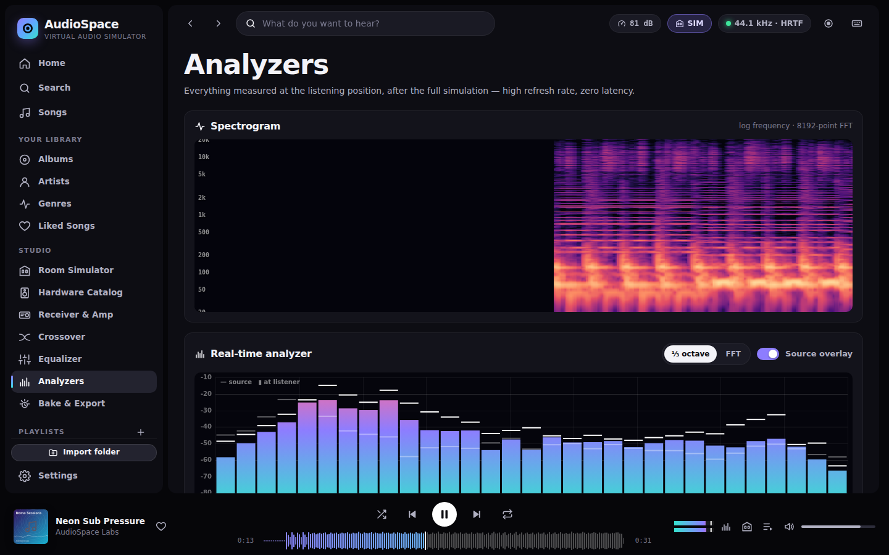 | 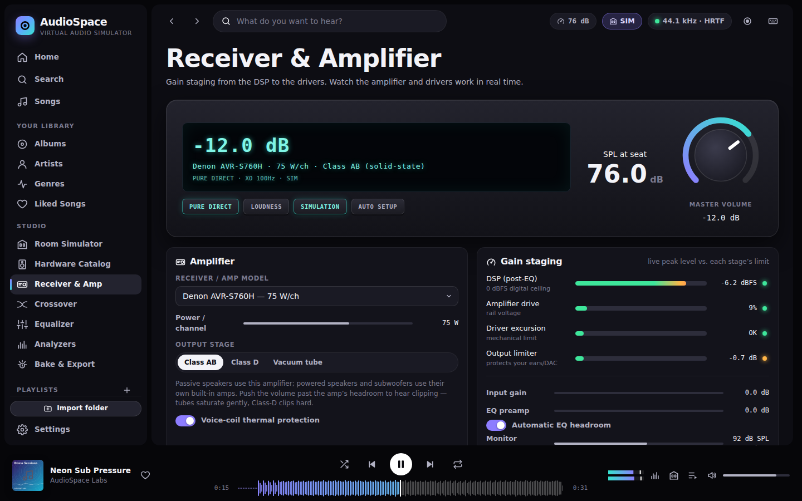 |
| 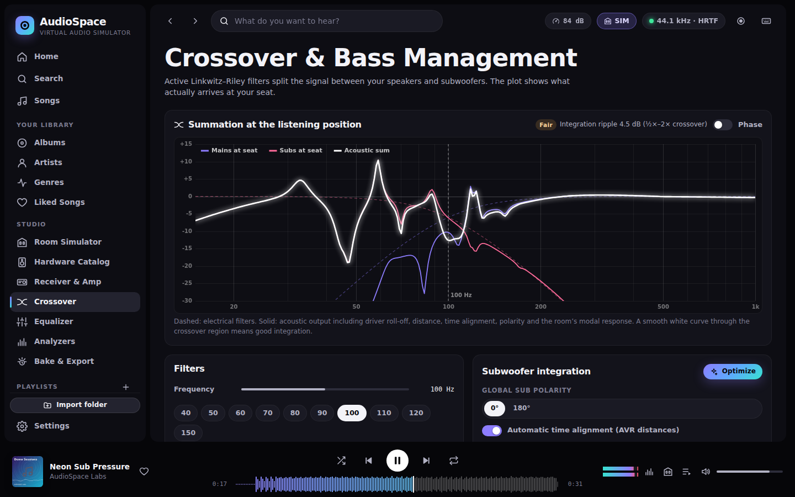 | 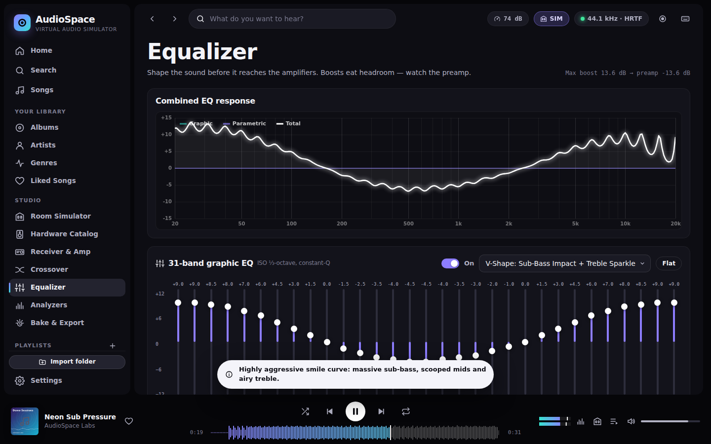 |

## Install

### Windows 10/11
Download **`AudioSpace-Setup-<version>.exe`** from the repository's *Releases* (built by the *Desktop builds* workflow for every `v*` tag, and attached to each workflow run as the `audiospace-desktop` artifact) and run it.

- Installs for your user only, into `%LOCALAPPDATA%\Programs\AudioSpace`; **no administrator rights** needed.
- Adds a Start menu shortcut (and optionally a desktop shortcut) and an entry in *Settings › Apps* for uninstalling. Silent install/uninstall: `AudioSpace-Setup-<version>.exe /S`, `Uninstall.exe /S`.
- The installer isn't code-signed yet, so SmartScreen may say *"Windows protected your PC"* — choose **More info › Run anyway**.
- Prefer no installation? `AudioSpace-<version>-portable.exe` is the same app as a single file.

### Arch Linux (and EndeavourOS, Manjaro, CachyOS, …)
One command — installs the build tools, builds a real pacman package (`audiospace-git`) with `makepkg` and installs it:

```bash
git clone https://github.com/googpleplaystore/Audio-simulator.git /tmp/audiospace && bash /tmp/audiospace/packaging/arch/install.sh
```

This uses your normal git credentials, so it also works while the repository is private. Once it is public you can instead run
`curl -fsSL https://raw.githubusercontent.com/googpleplaystore/Audio-simulator/HEAD/packaging/arch/install.sh | bash`.
Start AudioSpace from your application menu or with `audiospace`; remove it with `sudo pacman -R audiospace-git`. Installing `chromium` gives it its own app window (otherwise it opens in your default browser).

### How the desktop app works
The installers ship a small launcher (`desktop/`, Go, no dependencies) with the whole web app embedded. It serves the app on `127.0.0.1:47810` (a fixed port, so your library and settings — kept in the browser's storage — are there every time), opens it in a chromeless **Edge/Chrome/Chromium app window** (falling back to your default browser; set `AUDIOSPACE_BROWSER` to choose), reuses an already running instance, and quits by itself after the last window closes. Options: `--port`, `--no-browser`, `--keep-running`, `--version`.

Build everything yourself with `npm run build:desktop` (needs Go ≥ 1.22 and NSIS; `packaging/build-desktop.sh --linux` needs only Go). Output goes to `dist/`.

## Quick start (development)

```bash
npm start            # zero-dependency static server → http://localhost:8080
```

Open the page, then **Import music folder** (Chrome/Edge remember folder access between sessions via the File System Access API; Firefox/Safari fall back to `webkitdirectory`), **Choose files**, drag & drop folders anywhere, or click **Add demo & test tracks** for procedurally-synthesised music and calibration signals.

AudioSpace must be served from `http://localhost` or HTTPS (secure context for the File System Access API, AudioWorklet and the service worker). Deploy by copying the repository to any static host.

## Features

### Phase 1 — Library & Spotify-style player
- **Ingestion**: File System Access API directory picking with persistent handles, `webkitdirectory` fallback, drag-and-drop of folders/files, relinking, cancellable concurrent import with progress.
- **Metadata** (hand-written parsers, no libraries): ID3v2.2/2.3/2.4 (unsynchronisation, extended headers, APIC/PIC, TXXX ReplayGain, USLT lyrics), ID3v1, MPEG frame headers + Xing/Info/VBRI duration, FLAC STREAMINFO/Vorbis comments/PICTURE, MP4/M4A atoms (moov-at-end, `ilst`, `covr`, freeform `----`), RIFF/WAV + RF64 (INFO, `id3 ` chunk), AIFF, Ogg Vorbis/Opus (comments, granule duration), ADTS AAC. Filename/folder fallbacks and folder cover art (`cover.jpg`, `folder.jpg` …).
- **IndexedDB persistence** for tracks, artwork (content-hash de-duplicated, down-scaled thumbnails, dominant colours), waveforms, playlists, likes; LRU object-URL cache so large libraries never leak blob URLs.
- **UI**: dark premium interface with sidebar (Songs, Albums, Artists, Genres, Liked Songs, Playlists), virtualised track tables (multi-select, sortable columns, drag to playlists, in-playlist reordering), real-time search, album/artist/genre pages with colour-matched heroes, full-screen Now Playing with lyrics.
- **Playback bar**: interactive waveform seek (peaks decoded at low sample rate, cached), shuffle, repeat off/all/one, master volume, mini stereo level meter, like button.
- **Up Next** queue with a priority "Next in queue" list and the play context, both drag-and-drop reorderable (pointer-based, touch friendly), plus crossfade, gapless pre-loading, ReplayGain (track/album with peak protection), playback speed, Media Session (lock-screen) controls and session restore.

### Phase 2 — Hardware database
- Exactly **100 bookshelf speakers + 100 subwoofers** (`src/hardware/`, exportable to `data/hardware-db.json` via `npm run export:hardware`).
- **Seeds** use manufacturer-published specifications: Edifier R1280DBs, Klipsch RP-600M II, KEF LS50 Meta, Audioengine A2+ and HD6, Sony SS-CS5, Polk T15, ELAC Debut 2.0 B6.2, Micca PB42X, Vanatoo Transparent Zero, Sonos Era 100, Q Acoustics 3020i, B&W 607 S3, PreSonus Eris E3.5, Dali Spektor 2, Monitor Audio Bronze 50; SVS SB-1000 Pro and PB-1000 Pro, Klipsch R-120SW and R-100SW, Monoprice 9723, Sonos Sub Mini, KEF KC62, RSL Speedwoofer 10S II, Polk PSW10, Sony SA-CS9, ELAC SUB3030, Audioengine S8, Pyle PW18SUBA, Bose Bass Module 700, Dayton SUB-1200, BIC F12. Unpublished figures are flagged in `estimated`.
- **The remaining entries are extrapolated** from driver size, enclosure, amplification and price tier using loudspeaker physics (Hofmann's-iron-law style trade-offs between size, extension and efficiency), and flagged `specSource: "extrapolated"`.
- Every model gets a **response model**: 2nd-order (sealed, Qtc) or 4th-order (vented/PR) low-frequency roll-off at f3, port/tuning lift, HF limit, **brand house voicing** (e.g. Klipsch horn brightness, SVS flat and deep, Sony bass bump) and deterministic model-specific ripple, plus directivity (horns beam more) and power/SPL limits.
- Catalog UI with filters, sorting, procedural SVG product illustrations, detail pages with modelled response, and side-by-side comparison.

### Phase 3 — DSP, amplification and crossovers
- **Gain staging** (see `src/audio/plan.js`): digital full scale drives the amplifier to 100 W into 8 Ω; an amp rated *P* watts clips at √P⁄10; speaker sensitivity converts volts to SPL. Push a 10 W amp and you hear it clip; tubes saturate softly (even harmonics), Class-D clips hard.
- **Per-channel chain**: input gain → tone controls + ISO-226-style dynamic loudness → 31-band graphic EQ → 12-band parametric EQ → room correction → automatic EQ headroom → **0 dBFS DSP clip** → master volume (−80…+18 dB) → trims → amplifier (oversampled WaveShaper) → driver excursion limiting → **voice-coil thermal compression** (first-order thermal model) → sensitivity.
- **Active Linkwitz–Riley crossovers** LR12/LR24/LR48 (exact Q values; LR2 needs 180° to sum flat — try it), Small/Large speaker modes, global and per-sub polarity, continuous phase, delay, automatic AVR-style time alignment, and a one-click **integration optimiser**.
- **Room correction**: a virtual measurement microphone predicts the in-room response from the exact signal plan, then a greedy parametric fit pulls it towards Flat / Harman / B&K / X-curve targets with boost limits. **Auto setup** (Audyssey-style) sets channel levels, crossover and distances.
- Live meters: amplifier watts, clip and excursion LEDs, coil temperature, DSP overload, output limiter gain reduction, SPL at the seat.

### Phase 4 — Spatial audio and room physics
- Interactive top-down **room editor**: drag speakers, subwoofers and the listener; rotate with a handle; auto toe-in; wall materials by clicking walls; distances and arrival times; **first-reflection points** (the "mirror trick"); animated wavefronts; snap grid; keyboard nudging.
- **3D room view** (dependency-free perspective renderer): orbit/zoom/pinch, drag objects across the floor (Shift-drag for height), cut-away walls tinted by material, speaker/sub models with drivers, direct paths and first reflections in 3D, the bass heat map on the floor, and click-to-select walls.

  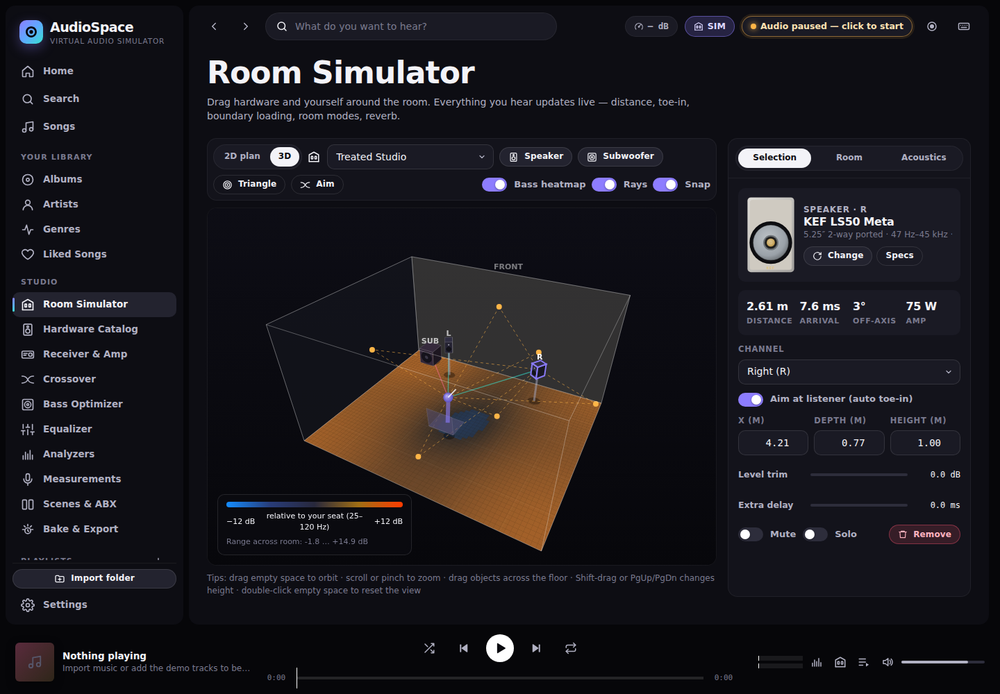
- **PannerNode** HRTF (or equal-power for speaker listening) with the inverse distance model (**inverse-square law**: −6 dB per doubling), propagation delay, off-axis high-frequency loss and air absorption.
- **Low-frequency modal model**: a modal sum of the rectangular room's eigenmodes with wall-dependent damping, averaged over a head-sized region and fitted to a compact minimum-phase filter bank per source. It reproduces **corner loading** (+6…+9 dB), SBIR cancellations and standing waves; a **bass heat map** shows seat-to-seat level variation, and a **smoothness map** (spread of the 25–120 Hz response at every point) marks the smoothest seat in the listening area with one-click "Move listener here". A simpler boundary-gain shelf model is available too.
- **Convolution reverb** from a synthesised **true-stereo impulse response**: image-source early reflections (order 1–5) with per-octave wall reflection coefficients, plus a diffuse tail per octave band decaying at the **Eyring RT60**, energy-calibrated to the statistical reverberant ratio 16π/R. Presets: Small Bedroom, Treated Studio, Vaulted-Ceiling Living Room, Home Theater, Concert Hall, Cathedral, Bathroom, Garage, Club, Office, Anechoic; materials include Glass, Bare Drywall, Heavy Curtains, Acoustic Foam, bass traps and more. IRs are generated in a Web Worker and hot-swapped with a crossfade.

### Phase 5 — Visualisation, haptics and export
- Spectrogram (log-frequency, magma colour map), ⅓-octave RTA and FFT with source overlay and peak hold, analog VU meters with IEC ballistics, vectorscope with phosphor persistence and phase-correlation meter, **EBU R128 loudness** (momentary, short-term, integrated, LRA).
- **Haptics**: sub-bass transients drive `navigator.vibrate` on phones and dual-rumble on connected gamepads, with a visual pulse on desktop.
- **Bake**: render any track through the full simulation with `OfflineAudioContext` to 16-bit (TPDF dither), 24-bit or 32-bit float WAV at 44.1/48/96 kHz, with progress; export/import DSP profiles; export the room's 4-channel impulse response; record the live output to WAV via an AudioWorklet.

### Phase 6 — Output protection and hygiene
- **True-peak lookahead limiter** (AudioWorklet): 4× oversampled inter-sample peak detection, 2.5 ms look-ahead, hold and release, adjustable ceiling (−0.1…−6 dBTP), used in realtime and by the offline bake, which reports sample and true peak and can normalise to −1 dBTP.
- Room-correction and room-emulation EQ fits respect their boost/cut limits for the **whole cascade** (overlapping filters can no longer stack past the limit), and fitted modal boosts may not ring longer than the room's physical modal damping allows.
- Plots release their observers when views and dialogs close.

### Phase 7 — Virtual acoustic measurements ("REW in the browser")
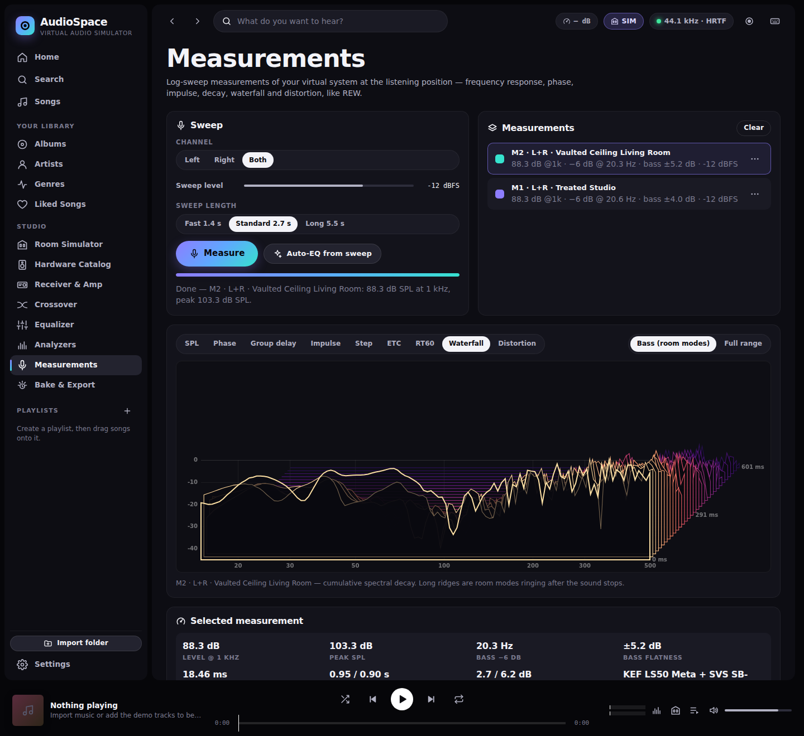

- An **exponential sine sweep** (Farina) is rendered through the complete simulation — EQ, crossover, amplifiers, drivers, room modes, reverb — to a virtual omni **measurement microphone** at the seat, then deconvolved into the impulse response plus separate **harmonic impulse responses**.
- Graphs: **SPL** (with ⅟₄₈…⅓-octave or psychoacoustic smoothing, 500 ms in-room to 5 ms quasi-anechoic windows), **phase**, **group delay**, **impulse**, **step**, **energy-time curve**, **RT60 per octave** (EDT, T20, T30, C50, C80, ISO 3382 style), **waterfall / cumulative spectral decay** (bass with an adaptive span, or full range) and **harmonic distortion** (H2…H5 and THD vs. frequency — push a 10 W amp and watch it rise).
- Overlays of up to 12 stored measurements (persisted in IndexedDB), renaming, **REW-compatible text export** (freq, SPL, phase) and **impulse-response WAV** export.
- **Auto-EQ from sweep**: measures with EQ bypassed, fits room-correction filters to the measured response, applies them and verifies with a second sweep.

### Phase 8 — Multi-sub optimiser, scenes and blind testing
| | |
|---|---|
| 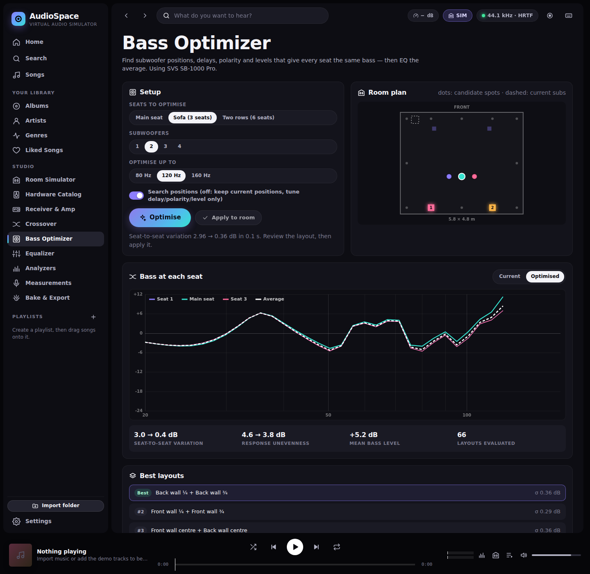 | 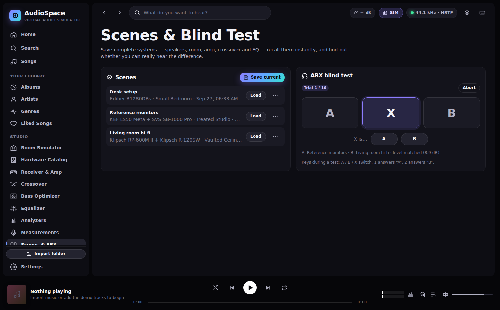 |

- **Bass Optimizer**: searches subwoofer positions (corners, mid-walls, quarter points), delays, polarity and levels for 1–4 subs to minimise the **seat-to-seat bass variation** over a sofa or two rows, then the unevenness of the average (what EQ can fix) — in the spirit of Welti's research and MSO. It uses the modal room model at every seat (head-region averaged), includes the receiver's automatic time alignment, runs in a Web Worker, and shows per-seat responses before/after, the top layouts and a room plan. It rediscovers the classics: one sub at the front-wall centre, two at the ¼/¾ points, four at the corners and mid-walls.
- **Scenes**: save complete systems (speakers, subs, room, receiver, crossover, EQ, room correction) and recall them instantly; example scenes included.
- **ABX blind test**: compare two scenes with randomised, balanced X assignments, predicted-loudness level matching (never boosting), keyboard control and a binomial p-value at the end; your original system is restored afterwards.

### Robustness
- AudioContext unlock on first gesture and recovery after OS interruptions; decks' `MediaElementSourceNode`s are created once; object URLs revoked on unload.
- Click-free parameter changes everywhere: `setTargetAtTime` smoothing, **double-buffered filter banks** (filter-type changes are crossfaded sample-accurately on the audio clock), **warmed-up reverb swaps** (the new room's convolver builds up silently before the outputs crossfade) and crossfaded A/B bypass. An E2E test records the engine output while sweeping EQ, filter types, crossover slopes, volume, bypass, speaker positions and rooms over a steady tone and fails on any discontinuity.
- Leak-checked: 60 rapid track switches leave heap, object URLs, audio nodes and DOM size unchanged; plots, workers and worklet processors are released when views close or recordings stop.
- Phones: the side panel starts closed and a **More** tab reaches every studio tool; storage-quota failures are reported instead of silently losing settings.
- A/B **bypass** with automatic level matching (`B`), PWA manifest + service worker.

## Keyboard shortcuts

`Space` play/pause · `←/→` seek · `Shift+←/→` previous/next · `↑/↓` volume · `M` mute · `S` shuffle · `R` repeat · `L` like · `Q` side panel · `B` A/B bypass · `/` or `Ctrl+F` search · `Ctrl+O` import · `?` help.

## Development

```bash
npm test             # unit tests (node:test): DSP maths, limiter, measurement analysis, acoustics, hardware DB, tag parsers, queue, signal plan
(cd desktop && go test ./...)   # desktop launcher tests
npm run test:e2e     # end-to-end scenarios in headless Chromium (Playwright)
npm run lint         # ESLint
```

### Architecture

```
src/
  dsp/         biquad maths identical to the Web Audio spec, LR crossovers, FFT, EQ fitting, curves/presets
  acoustics/   materials, Eyring/Sabine, room modes + modal sum, boundary gain, image-source IR synthesis,
               multi-sub optimiser, worker
  hardware/    seed specs, extrapolation engine, brand voicing, receivers, response model
  library/     tag parsers, importer, IndexedDB library model, artwork, waveforms, demo synthesis
  player/      queue model, dual-deck player
  audio/       plan (state → every parameter), engine (Web Audio graph), predict (virtual mic),
               calibration (auto-EQ/auto setup), measure (sweep measurements), bake/recorder,
               worklets (true-peak limiter, recorder), haptics, WAV codec
  viz/         canvas loop, response/XY/waterfall/bar plots, analyzers, room editor
  core/        store, settings/migration, IndexedDB, scenes + ABX statistics
  ui/          app controller, router, shell, components, views
desktop/       Go launcher that embeds and serves the web app (Windows/Linux/macOS)
packaging/     build script, NSIS installer (windows/), PKGBUILD + one-command installer (arch/), icons
```

The **signal plan** is the heart of the design: a pure function turns application state into every filter, gain, delay and position. The realtime engine, the offline bake renderer, the frequency-response predictor, the auto-EQ and the unit tests all consume the same plan, so what you see is what you hear.

## Accuracy notes

Rankings are illustrative (Amazon best-seller ranks change hourly). Seed specifications follow manufacturers' published figures to the best of our knowledge; extrapolated entries are physics-based estimates, clearly flagged in the UI and data. The acoustic models are engineering approximations intended to be educational and plausible, not a substitute for measurements.

## License

MIT
